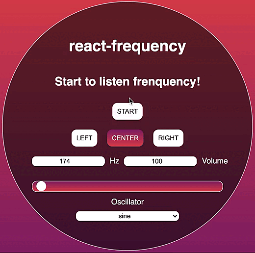

# `react-frequency`

A simple React component and hook which emits a frequency generated thanks to the AudioContext API of JavaScript !

[Live Demo](https://codesandbox.io/s/react-frequency-0t7tt?file=/src/Hook.js)



## Installation

_npm_

```sh
npm install react-frequency
```

_yarn_

```sh
yarn add react-frequency
```

## Usage

#### Hook
```js
import React from 'react';
import { useFrequency } from 'react-frequency';

const App = () => {
  const { toggle, start, stop, playing } = useFrequency({
    hz: 174,
    type: "center",
    gain: 1,
    oscillator: "sine"
  })

  return (
    <div>
      <h1>playing: { playing ? 'true' : 'false' }</h1>
    
      <button onClick={toggle}>toggle</button>
      
      <button onClick={start}>start</button>
      <button onClick={stop}>stop</button>
    </div>
  )
};
```
The `useFrequency` hook return 3 functions and 1 boolean :
###### functions
- `toggle`: **start and stop** the frequency
- `start`: **start** the frequency
- `stop`: **stop** the frequency

###### boolean
- `playing`: reading **state** of the frequency

<br/>

#### Component
```js
import React from 'react';
import { Frequency } from 'react-frequency';

const App = () => (
  <Frequency
    hz={174}
    type="center"
    gain={1}
    oscillator="sine"
  />
);
```
The component does not return any elements and emits automatically the frequency.<br/>

<br/>

## Props

The only props required is hz.<br/>

| Name        | Default           | Description  |
| ------------- |:-------------:| -----:|
| `hz` | `required`<br/>`number` | The frequency corresponds to the number of vibrations per second.<br/>The human ear hears values ranging from 20Hz to 20,000Hz |
| `type` | `not required`<br/>"center" | The type defines from which side the sound will come out.<br/>Values can be "left", "center" or "right" |
| `gain` | `not required`<br/>1 | The gain defines the ability to increase the strength of a signal.<br/>Value is float between 0 and 1 |
| `oscillator` | `not required`<br/>"sine" | It specifies what shape of waveform the oscillator will output.<br/>Values can be "sine", "square", "sawtooth" or "triangle" |

<br/>

### A complete exemple is available in the [Live Demo](https://codesandbox.io/s/react-frequency-0t7tt?file=/src/Hook.js)

<br/>