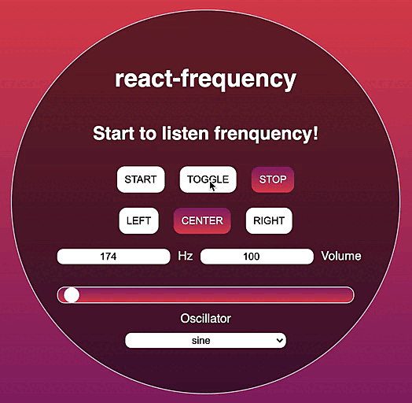

# `react-frequency`

A simple React component which creates a frequency and play it !

[Live Demo](https://codesandbox.io/s/react-frequency-0t7tt?file=/src/App.js)



## Installation

_npm_

```sh
npm install react-frequency
```

_yarn_

```sh
yarn add react-frequency
```

## Usage

```js
import React from 'react';
import { Frequency } from 'react-frequency';

const App = () => (
  <Frequency
    hz={174}
  />
);
```
The component does not return any elements.<br/>
It emits a frequency generated thanks to the AudioContext API of JavaScript.<br/>
The only props required is hz

## Props

| Name        | Default           | Description  |
| ------------- |:-------------:| -----:|
| `hz` | `required` | The frequency corresponds to the number of vibrations per second.<br/>The human ear hears values ranging from 20Hz to 20,000Hz |
| `type` | `not required` "center" | The type defines from which side the sound will come out.<br/>Values can be "left", "center" or "right" |
| `gain` | `not required` 1 | The gain defines the ability to increase the strength of a signal.<br/>Value is float between 0 and 1 |
| `oscillator` | `not required` "sine" | It specifies what shape of waveform the oscillator will output.<br/>Values can be "sine", "square", "sawtooth" or "triangle" |


### A complete exemple is available in the [Live Demo](https://codesandbox.io/s/react-frequency-0t7tt?file=/src/App.js)